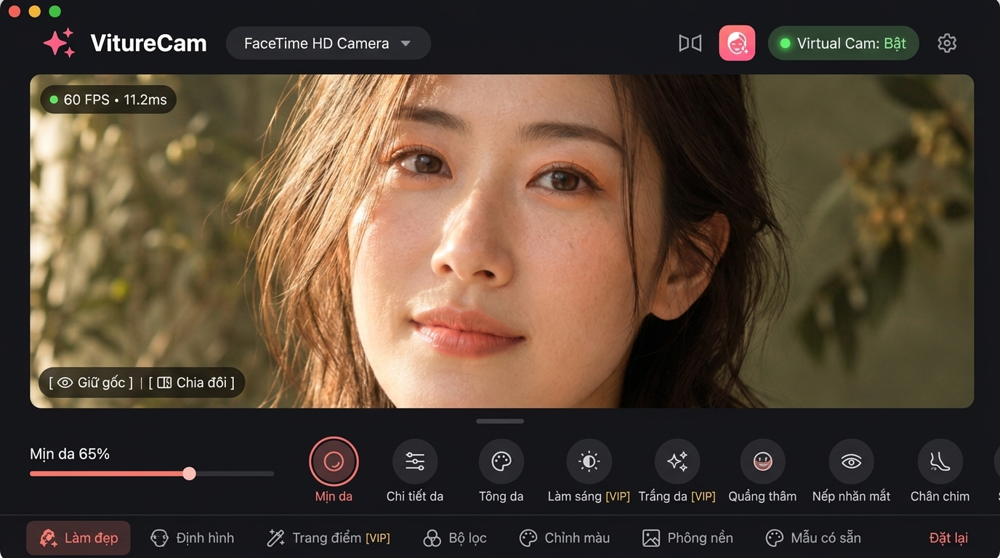

<div align="center">

# 🌸 VitureCam — AI Beauty Virtual Camera for macOS

<p align="center">
  
</p>

[](https://apple.com)
[](https://flutter.dev)
[](https://developer.apple.com/metal/)
[](https://developer.apple.com)
[](https://patreon.com)
[](LICENSE)

<br/>

**VitureCam** là ứng dụng Webcam ảo và Làm đẹp AI thời gian thực (*Real-time AI Beauty Virtual Camera*) chuyên nghiệp dành riêng cho hệ điều hành macOS. Ứng dụng tận dụng tối đa sức mạnh phần cứng Apple Silicon (M1/M2/M3/M4) thông qua pipeline tăng tốc **Apple Metal Shaders**, **CoreImage** và nhận diện khuôn mặt **MediaPipe 468-point 3D Face Mesh**.

</div>

---

## 🌟 Điểm Nổi Bật (Key Features)

### 1. 💄 Trang Điểm AR Thời Gian Thực (AR Makeup Studio)
- **Phấn mắt trong trẻo Hàn Quốc (K-Dewy Eyeshadow)**:
  - **9 kiểu dáng độc đáo**: Trong trẻo (*K-Dewy* kèm bọng mắt cười *aegyo-sal*), Phủ sương (*Soft Sheer* mỏng nhẹ), Ánh nhũ (*Shimmer* bắt sáng tâm mắt & khóe mắt), Mắt cún (*Puppy Eyes* ngây thơ tròn xoe), Tâm sáng (*Halo Glow*), Tán loang (*Gradient* chân mi lên bầu mắt), Douyin, Đuôi V (*Outer V*), Cắt mí (*Cut Crease*).
  - **8 bảng màu trong suốt chuẩn Hàn**: Đào sương (`dewyPeach`), Hồng sữa (`milkyPink`), Trà mơ sữa (`apricotMilk`), San hô trong (`glassCoral`), Nhũ ngọc trai (`pearlGlow`), Dâu mọng (`berryDew`), Nâu sữa (`softMocha`), Cam bưởi (`grapefruit`).
- **Son môi đa chất liệu**: Đánh lòng môi Ombre, son bóng căng mọng (Gloss), son lì mịn màng (Matte) và son viền tự nhiên với thuật toán pha màu quang học chân thực.
- **Má hồng rạng rỡ**: Má quả táo (Apple cheek), má nâng gò má (Lifted), ửng nắng (Sunkissed), và má hồng bọng mắt dưới chuẩn style Hàn (Undereye blush).
- **Kẻ mắt & Định hình chân mày**: Đường kẻ mí trong tự nhiên, đuôi mảnh, mắt mèo, mắt cún, mắt cáo; đa dạng kiểu dáng mày nữ và mày nam tự nhiên/dáng kiếm.
- **Tạo khối & Bắt sáng (Contour & Highlight)**: Tôn đường nét sống mũi cao thon, khối gò má, cằm và trán 3D sắc sảo.
- **Kính áp tròng (Contact Lens) & Ánh mắt long lanh (Eye Sparkle Catchlight)**: Tùy biến màu tròng mắt và điểm phản quang long lanh.

### 2. ✨ Làm Đẹp & Trẻ Hóa Làn Da (AI Skin Perfection)
- **Làm mịn da thông minh (Skin Smoothing)**: Bộ lọc song phương (Bilateral Filter) làm mịn da tự nhiên, giữ nguyên cấu trúc lỗ chân lông và chi tiết tóc/mắt.
- **Làm sáng & Làm trắng da cao cấp (Skin Brightness & Whitening — VIP)**: Nâng tông trắng hồng tự nhiên, không bị cháy sáng hay bợt da.
- **Trẻ hóa đôi mắt**: Xóa thâm quầng mắt (*Dark Circles*), xóa bọng mắt (*Eye Bags*), làm mờ nếp nhăn mí mắt và vết chân chim đuôi mắt (*Crow's Feet*).
- **Làm mờ rãnh cười & nếp nhăn trán/cổ**: Làm đầy rãnh cười (*Nasolabial Folds*), nếp nhăn trán và nếp nhăn cổ tức thì.
- **Làm trắng răng tự nhiên (Teeth Whitening)**: Nhận diện khuôn miệng và làm sáng nụ cười rạng rỡ.

### 3. 📐 Phẫu Thuật Thẩm Mỹ 3D (3D Mesh Reshaping)
- **Gọt hàm & Tạo mặt V-Line**: Thu gọn góc hàm (*Jaw Width — VIP*), gọt mặt thon gọn (*Face Slim*), chỉnh độ nhô và chiều dài cằm (*Chin Length*).
- **Mở rộng đôi mắt**: Tăng kích thước mắt (*Eye Enlarge*), cân chỉnh khoảng cách hai mắt (*Eye Distance*).
- **Thu gọn sống mũi**: Thu hẹp cánh mũi (*Nose Slim*), nâng cao chóp mũi (*Nose Tip*).
- **Định hình khuôn miệng**: Thu nhỏ miệng, tinh chỉnh độ dày viền môi trên/dưới.
- **Hạ gò má**: Giảm độ nhô xương gò má tự nhiên (*Cheekbone Slim*).

### 4. 🎨 Bộ Lọc Điện Ảnh 3D LUT & Chỉnh Màu Chuyên Sâu
- Kho preset LUT phong phú: Natural, Film, Vintage, Cyberpunk, Black & White, Douyin Aesthetic (*VIP*).
- Bộ công cụ Color Grading: Nhiệt độ màu (Temp), Sắc thái (Tint), Độ bão hòa (Saturation), Độ tương phản (Contrast), Vùng sáng (Highlights), Vùng tối (Shadows), và Hiệu ứng viền tối nghệ thuật (Vignette).

### 5. 📹 Virtual Camera Driver Tương Thích Tuyệt Đối
- Tích hợp driver webcam ảo cấp hệ thống qua **CoreMediaIO DAL Plugin**.
- Tương thích trực tiếp không cần cấu hình phức tạp trên:
  - 🎥 **Livestream**: OBS Studio, Streamlabs, Prism Live Studio.
  - 💼 **Hội nghị & Học tập**: Zoom, Google Meet, Microsoft Teams, Skype, Webex.
  - 💬 **Giao tiếp xã hội**: FaceTime, Discord, Telegram, Safari, Chrome.
- Xử lý luồng hình ảnh 60 FPS mượt mà với độ trễ cực thấp (< 15ms).

### 6. 💎 Hệ Thống Thành Viên Patreon VIP
- Đăng nhập nhanh chóng, bảo mật qua OAuth2 và Creator Token.
- Mở khóa các đặc quyền VIP độc quyền:
  - *Bộ lọc Douyin điện ảnh đỉnh cao*
  - *Thu gọn xương hàm V-line chuyên sâu (Jaw Width)*
  - *Làm trắng da cao cấp (Skin Whitening)*
  - *Làm sáng da tự nhiên (Skin Brightness)*
- Tự động đồng bộ trạng thái hội viên và gia hạn quyền lợi theo thời gian thực.

### 7. 🔄 Cập Nhật Ứng Dụng Tự Động (Auto-Updater)
- Tự động kiểm tra bản cập nhật mới nhất từ máy chủ GitHub Releases.
- Tải về và cài đặt trực tiếp bản cập nhật mới chỉ với một cú nhấp chuột.

---

## 🛠️ Kiến Trúc Công Nghệ (Tech Stack)

```
┌────────────────────────────────────────────────────────┐
│             VitureCam Frontend (Flutter 3.x)           │
│   • Riverpod State Management  • Clean Architecture    │
│   • Responsive Glassmorphic UI • Dynamic L10n (VI/EN)  │
└───────────────────────────┬────────────────────────────┘
                            │ Platform Channel
┌───────────────────────────▼────────────────────────────┐
│              macOS Native Backend (Swift)              │
│   • MediaPipe / Apple Vision: 468-point 3D Face Mesh   │
│   • Metal Compute Shaders: Real-time Warp & Pigment    │
│   • CoreImage & CoreVideo: GPU-accelerated Rendering   │
│   • CoreMediaIO DAL Plugin: System-wide Virtual Camera │
└────────────────────────────────────────────────────────┘
```

---

## 💻 Yêu Cầu Hệ Thống (System Requirements)

- **Hệ điều hành**: macOS 13.0 (Ventura) trở lên (khuyên dùng macOS 14 Sonoma hoặc macOS 15 Sequoia).
- **Phần cứng**: 
  - Tối ưu tốt nhất cho chip **Apple Silicon** (M1, M2, M3, M4, Pro, Max, Ultra).
  - Hỗ trợ Intel Mac có card đồ họa rời tương thích Metal.
- **Webcam**: Camera tích hợp trên máy Mac, Continuity Camera (iPhone) hoặc bất kỳ USB/Thunderbolt Webcam ngoài nào.

---

## 🚀 Hướng Dẫn Cài Đặt & Phát Triển (Development Setup)

### 1. Chuẩn bị môi trường
- Đảm bảo đã cài đặt [Flutter SDK](https://flutter.dev/docs/get-started/install/macos) (^3.11.5).
- Xcode 15 hoặc mới hơn cùng với Command Line Tools.

### 2. Tải mã nguồn & Cài đặt dependencies
```bash
git clone https://github.com/vqh2602/viturecam.git
cd viturecam

# Lấy các thư viện Flutter
flutter pub get
```

### 3. Biên dịch và Chạy trên macOS
```bash
# Khởi chạy chế độ Debug
flutter run -d macos

# Kiểm tra lint code
flutter analyze

# Chạy toàn bộ bài kiểm thử
flutter test
```

### 4. Build bản phát hành (Release)
```bash
flutter build macos --release
```

---

## 📄 Bản Quyền & Điều Khoản Sử Dụng (Copyright & License)

**Copyright © 2026 Vương Quang Huy ([@vqh2602](https://github.com/vqh2602) / `huyvq.bachkhoa@gmail.com`). All rights reserved.**

Toàn bộ bản quyền đối với phần mềm **VitureCam**, bao gồm kiến trúc mã nguồn, hệ thống Metal Shaders, thuật toán xử lý luồng Virtual Camera CoreMediaIO DAL, tài nguyên đồ họa và nhãn hiệu đều thuộc quyền sở hữu trí tuệ hợp pháp của **Vương Quang Huy**.

- **Sử dụng cá nhân**: Người dùng được tự do cài đặt, trải nghiệm và sử dụng các tính năng cơ bản của phần mềm cho mục đích cá nhân.
- **Tính năng VIP (Patreon Gated Features)**: Các tính năng nâng cao (bộ lọc Douyin, làm trắng da, làm sáng da, gọt hàm V-line) được quản lý và cấp phép thông qua chương trình thành viên Patreon chính thức.
- **Nghiêm cấm**: Mọi hành vi sao chép, dịch ngược mã nguồn (reverse engineering), bẻ khóa (crack/bypass), hoặc kinh doanh lại phần mềm và tài nguyên đồ họa khi chưa có sự đồng thuận bằng văn bản từ tác giả.

Chi tiết xem tại tệp tin [LICENSE](file:///Users/vuongquanghuy/code/flutter_project/viturecam/LICENSE).

---

<div align="center">
  <sub>Được thiết kế và phát triển với trọn vẹn tâm huyết bởi <b>Vương Quang Huy</b>.</sub>
</div>
